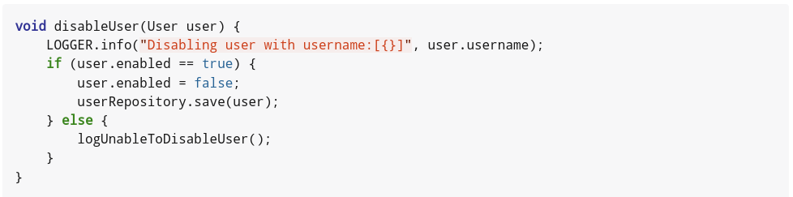
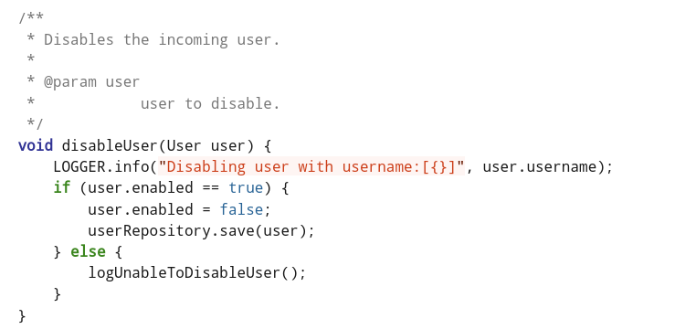

= AsciiDoctorJ Extensions
ifndef::env-github[]
:icons: font
:source-highlighter: rouge
endif::[]
ifdef::env-github[]
:caution-caption: :fire:
:important-caption: :exclamation:
:note-caption: :paperclip:
:tip-caption: :bulb:
:warning-caption: :warning:
:source-highlighter: rouge
endif::[]
:toc:
:toc-placement!:
:toclevels: 4
:asciidoctorj-version: 2.5.7

[.text-center]
image:https://img.shields.io/maven-central/v/org.rodnansol/asciidoctorj-extensions.svg[Maven Central]
image:https://img.shields.io/badge/License-Apache_2.0-blue.svg[Apache 2.0]
image:https://img.shields.io/twitter/url/https/twitter.com/rodnansol.svg?style=social&label=Follow%20%40RodnanSol[]
image:https://dcbadge.vercel.app/api/server/USyh6XUjvP[Discord]

toc::[]

== Goals

This project would like to give you more custom options for your AsciiDoc files, and it would like to extend your experience with new features.

== Introduction

The project is built with Java 11 and with the latest ({asciidoctorj-version}) AsciidoctorJ dependency.

The following new macros are available by this project:

- `JavaSourceIncludeProcessor`: With the help of this include macro you can include specific sections (fields, methods) of your Java source code, and you do not have to pollute your source code with *tag* markers.

== Feature examples

=== JavaSourceIncludeProcessor

Usage:
[source,adoc]
----
include::javasource[source='<path-to-java-source>', <.>
method='<name-of-the-method-to-extract>', field='<name-of-the-field-to-extract>', <.>
withJavaDoc='true|false', <.>
spaceSize='<space-size>' <.>
lineLength='<maximum-line-length>' <.>
]
----
1. Path to the source code.
2. The name of the method or field to be extracted.
3. If the JavaDoc is needed, specify it with true
4. If the final extracted code should be reformatted with different space indentation size specify it.
5. If the source code is too long with that breaks can be applied - Unfortunately the *Roaster* dependency's formatter is not working properly, so use it with caution.

.A few examples
[%collapsible]
====
.Java source code
[source,java]
----
class UserService {

    private static final Logger LOGGER = LoggerFactory.getLogger(UserService.class);
    private final UserRepository userRepository;

    public UserService(UserRepository userRepository) {
        this.userRepository = userRepository;
    }

    /**
     * Creates a new user based on the incoming stuff.
     */
    public final User createUser(String username, String password) {
        LOGGER.info("Creating new user with username:[{}]", username);
        userRepository.save(new User(username, password));
    }

    protected void deleteUser(String username) {
        LOGGER.info("Deleting user with username:[{}]", username);
        userRepository.deleteByUsername(username);
    }

    /**
    * Disables the incoming user.
    * @param user user to disable.
    */
    void disableUser(User user) {
        LOGGER.info("Disabling user with username:[{}]", user.username);
        if (user.enabled == true) {
            user.enabled = false;
            userRepository.save(user);
        } else {
            logUnableToDisableUser();
        }
    }

    private static void logUnableToDisableUser() {
        LOGGER.info("Unable to disable disabled user");
    }

}
----

.AsciiDoc file with the include macro to extract a method
[source,adoc]
----
\include::javasource[source={docdir}/UserService.java,method='disableUser']
----

.Result

.AsciiDoc file with the include macro to extract a method with JavaDoc
[source,adoc]
----
\include::javasource[source={docdir}/UserService.java,method='disableUser',withJavaDoc='true']
----

.Result

.AsciiDoc file with the include macro to extract a field
[source,adoc]
----
\include::javasource[source={docdir}/UserService.java,field='LOGGER']
----

.Result

====

Check the link:docs/showcase.html[following file]  for a full showcase.

NOTE: Because the requested source code is being formatted with Roaster's Eclipse formatter it can happen that the final code does not look the same as the original.

== Usage

=== Maven setup
In case you are using the AsciidoctorJ Maven plugin the setup is the following:

[,xml]
----
<plugin>
    <groupId>org.asciidoctor</groupId>
    <artifactId>asciidoctor-maven-plugin</artifactId>
    <version>${asciidoctor-maven-plugin.version}</version>
    <dependencies>
        <dependency>
            <groupId>org.rodnansol</groupId>
            <artifactId>asciidoctorj-extensions</artifactId>
            <version>${asciidoctorj-extensions.version}</version>
        </dependency>
    </dependencies>
</plugin>
----

=== IntelliJ IDEA
If you are using the https://plugins.jetbrains.com/plugin/7391-asciidoc[AsciiDoc] IDEA plugin and you would like to utilize the extension in your IDE too you have 2 options

==== Per project
Run the https://raw.githubusercontent.com/rodnansol/asciidoctorj-extensions/master/scripts/idea-setup.sh[following script] in your project's *root* folder, and it will create a hidden folder called `.asciidoctor/lib` and it will place the *shaded* JAR into this folder. It will extend your `.gitignore` file to make sure you are not committing any binary to your remote repository.
``

==== Globally
This method requires you to search the IDEA's plugin folder and place the *shaded* jar into this.

For example, if you installed your IDEA with Toolbox on Linux then the path can be the following: `~/.local/share/JetBrains/Toolbox/apps/IDEA-U/ch-0/223.8214.52.plugins/asciidoctor-intellij-plugin/lib/`

.Script to download the latest *shaded* jar:
[,shell]
----
#!/bin/bash
wget https://repo1.maven.org/maven2/org/rodnansol/asciidoctorj-extensions/maven-metadata.xml -O /tmp/asciidoctorj-extensions-maven-metadata.xml -q
LATEST_VERSION=($(grep -oP '(?<=latest>)[^<]+' "/tmp/asciidoctorj-extensions-maven-metadata.xml"))
JAR_FILE=.asciidoctor/lib/asciidoctorj-extensions-${LATEST_VERSION}-shaded.jar
wget https://repo1.maven.org/maven2/org/rodnansol/asciidoctorj-extensions/${LATEST_VERSION}/asciidoctorj-extensions-${LATEST_VERSION}-shaded.jar -O asciidoctorj-extensions-${LATEST_VERSION}-shaded.jar
----

=== Eclipse

Feel free to open a PR with the detailed steps.

=== VS Code

Feel free to open a PR with the detailed steps.

=== Atom

Feel free to open a PR with the detailed steps.

== Contribution

Feel free to contribute, fork the project and open pull requests.

== FAQ

.Can I use it with non AsciidoctorJ based project?
- No. This project utilizes AsciidoctorJ and all extensions are written in *Java*, so *Ruby* based projects are not able to utilize these extensions.
- (Feel free to open and issue where you can migrate the existing Java code to Ruby.)

